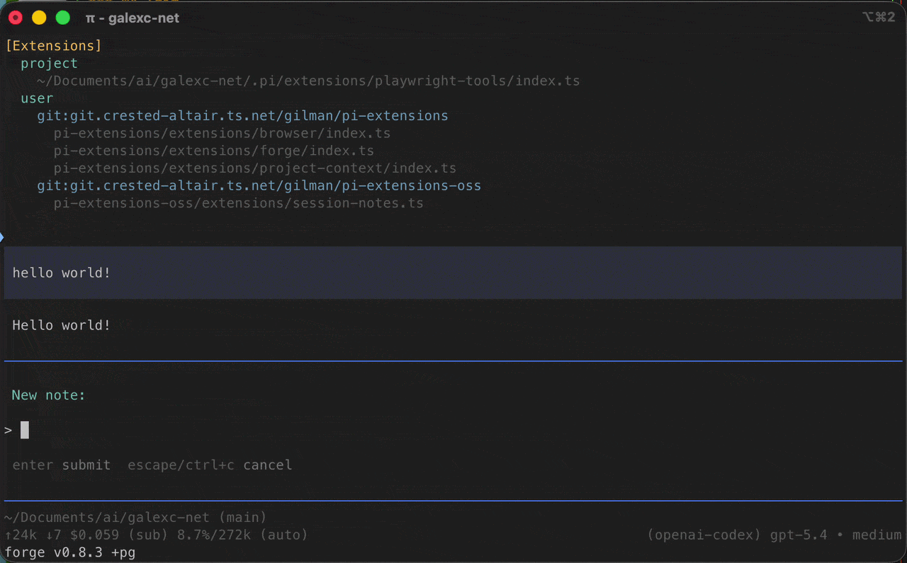
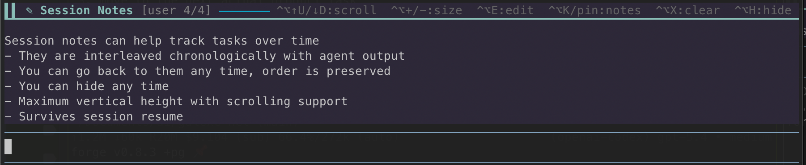
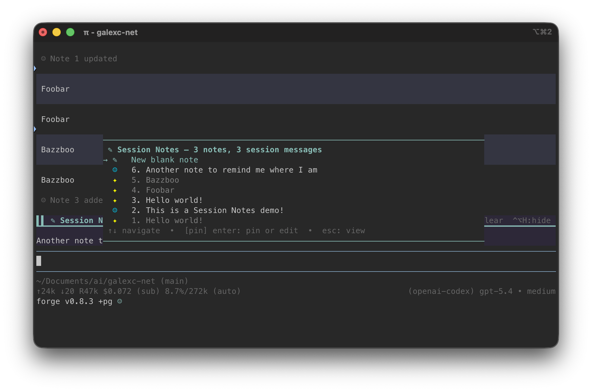

# Session Notes for Pi

A zero-token session scratchpad for Pi.

`session-notes` keeps important notes visible above the editor and lets you pin assistant messages into an interleaved timeline without spending context tokens.

## Demo

### Looping teaser



### Persistent panel



### Timeline picker




## session-notes

`session-notes` adds a persistent notes panel and an interleaved timeline picker for session notes and assistant messages.

It is built for the moment when a session is going well, useful snippets are flying by, and you want to keep a few things pinned in view without copying them back into the prompt.

### Highlights

- persistent notes panel above the editor
- zero-token workflow for keeping notes visible
- interleaved picker that mixes your notes with assistant messages in one timeline
- direct note editing and quick pinning from the picker
- user and agent notes visually differentiated
- append-only note history where entries are never deleted
- branch, fork, tree, and reload aware state reconstruction
- keyboard-first controls with no external editor required

### What it is good for

- keeping a short plan visible while you continue coding
- pinning a useful assistant response before the conversation moves on
- jotting down a quick human note for later in the same session
- comparing your notes against recent assistant messages in chronological order
- keeping transient context out of the actual prompt

### Controls

| Action | Shortcut / Command |
| --- | --- |
| Open timeline picker | `Ctrl+Alt+K` or `/pin` |
| Edit active note | `Ctrl+Alt+E` |
| Hide or show panel | `Ctrl+Alt+H` |
| Clear active note content | `Ctrl+Alt+X` |
| Scroll up | `Ctrl+Alt+U` or `Ctrl+Alt+Up` |
| Scroll down | `Ctrl+Alt+D` or `Ctrl+Alt+Down` |
| Expand panel height | `Ctrl+Alt+=` |
| Contract panel height | `Ctrl+Alt+-` |

### Interaction model

- **Blank notes** are user-authored notes you type directly.
- **Pinned timeline items** are assistant messages captured into the note log.
- **Entries are append-only.** You can clear content, but the entry itself stays in history.
- **IDs are session-local.** A fresh session starts at note 1 again.
- **Ordering is chronological.** The picker interleaves notes and assistant messages by session timing.

## Install

### From GitHub

```bash
pi install git:github.com/thegalexc/pi-extensions-oss
```

### Local development install

```bash
pi install /Users/callsen/Documents/ai/pi-extensions-oss
```

After installation, restart Pi or run `/reload` in an active session.

## Update

```bash
pi update
```

## Development

```bash
pnpm install
pnpm run typecheck
```

## Compatibility notes

`session-notes` is designed for interactive Pi sessions with the TUI enabled.

The extension leans into terminal-safe rendering choices:

- custom picker rows for reliable alignment
- keyboard-native interaction
- theme-aware coloring using Pi theme tokens
- glyph choices that behave well in common terminal fonts

## Repo layout

```text
pi-extensions-oss/
├── extensions/
│   └── session-notes.ts
├── package.json
├── tsconfig.json
├── CLAUDE.md
└── README.md
```

## Roadmap

Near-term polish still worth doing:

- cut a tagged first release

## License

MIT
