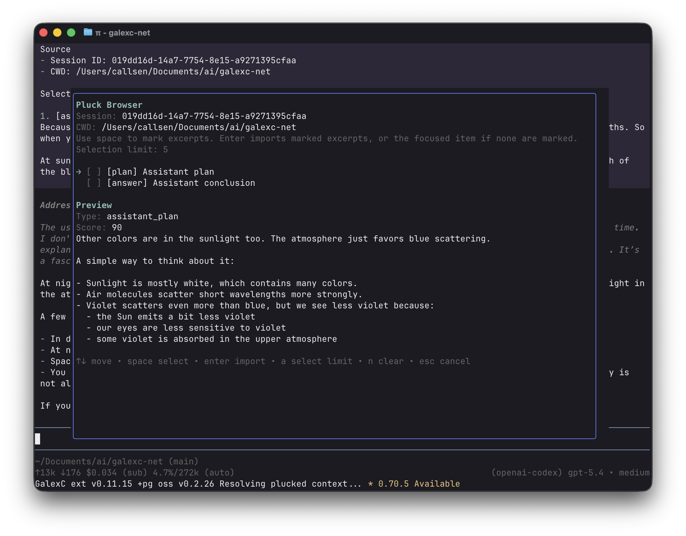
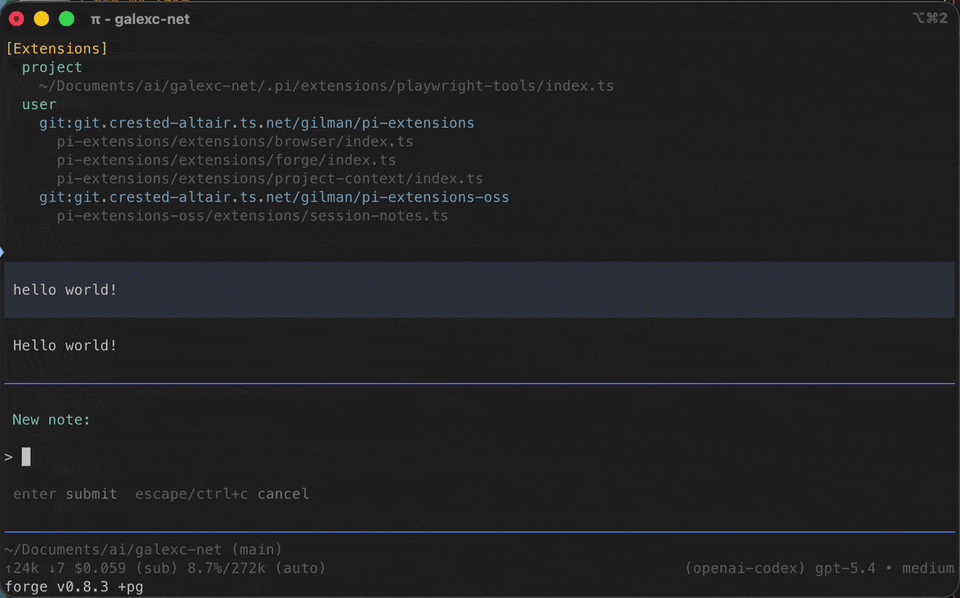
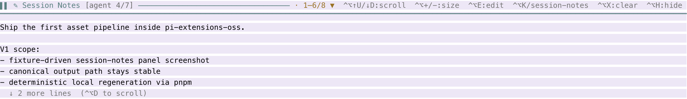
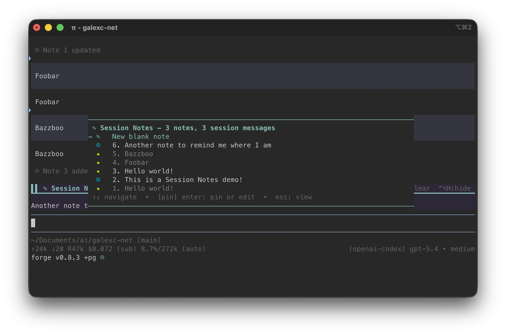
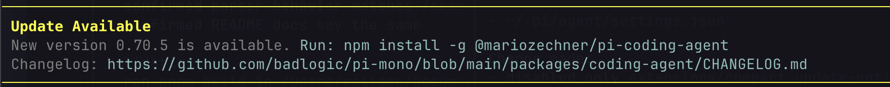
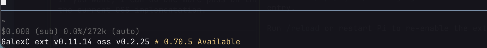

# Pi Extensions - GalexC

Productivity and resilience extensions for the [Pi coding agent](https://pi.ai).

`pluck` lets you browse another persisted Pi session by exact id and import only the useful excerpts into the current turn. `session-notes` keeps important context visible above the editor without spending context tokens. `aside` adds a token-efficient side-question overlay that borrows only a bounded slice of the current session. `browser-screenshot` adds a Playwright-backed `screenshot` tool with built-in safety guards. `screenshots-picker` lets you browse, stage, and auto-attach recent screenshots. `agents-prompts-discover` bridges installed prompts from `.agents/prompts` into Pi command discovery. `library-manifest` warns when a repo's required library-managed artifacts are missing at session start. `compact-update-notice` turns Pi's large boxed startup update warning into a small faded-yellow footer chip. `todo` adds a lightweight branch-aware session todo primitive. `status` adds an `oss v<version>` footer status chip.

## Extensions

| Extension | What it does |
|---|---|
| [`pluck`](#pluck) | Browse another persisted session by exact id and import only selected high-signal excerpts |
| [`session-notes`](#session-notes) | Zero-token session scratchpad with persistent panel and interleaved timeline |
| [`aside`](#aside) | Tool-free side-question overlay with bounded current-session context |
| [`browser-screenshot`](#browser-screenshot) | Playwright-backed `screenshot` tool with built-in image safety guards |
| [`screenshots-picker`](#screenshots-picker) | Browse, stage, and auto-attach recent screenshots from inside Pi |
| [`agents-prompts-discover`](#agents-prompts-discover) | Additive prompt discovery bridge for project and global `.agents/prompts` |
| [`library-manifest`](#library-manifest) | Warn when a repo's required library-managed artifacts are missing or colliding |
| [`compact-update-notice`](#compact-update-notice) | Replace Pi's large startup update box with a compact faded-yellow footer chip |
| [`todo`](#todo) | Lightweight branch-aware session todo list for the model and the user |
| `status` | Package-level footer status chip showing the loaded OSS version |

---

## pluck

`/pluck <session-id> [query]` opens a focused browser for another persisted Pi session and lets you import only the excerpts you want.

It is built for the moment when you have a useful earlier session, want to reuse just the relevant pieces, and do not want to dump a whole transcript into the current prompt.

### Demo



### Highlights

- exact session targeting by persisted session id from `/session`
- deterministic chunk extraction for user goals, plans, conclusions, compaction summaries, labels, and semantic tool findings
- optional query-aware ranking so relevant excerpts float to the top
- multi-select browser overlay with preview and selection limits
- compact imported custom message payload that stays within a bounded character budget
- warning when the source session cwd differs from the current cwd

### What it is good for

- pulling forward the useful part of a previous coding session
- reusing a prior plan or conclusion without reopening that whole transcript
- importing only the parts of a cross-repo session that matter right now
- carrying forward high-signal tool findings without bringing noisy shell output

### Command

| Command | Purpose |
| --- | --- |
| `/pluck <session-id> [query]` | Browse, select, and import focused context from another persisted session |

---

## session-notes

`session-notes` adds a persistent notes panel and an interleaved timeline picker for session notes and assistant messages.

It is built for the moment when a session is going well, useful snippets are flying by, and you want to keep a few things pinned in view without copying them back into the prompt.

### Demo

#### Looping teaser



#### Persistent panel



#### Timeline picker



### Highlights

- persistent notes panel above the editor
- zero-token workflow for keeping notes visible
- interleaved picker that mixes your notes with assistant messages in one timeline
- direct note editing and quick pinning from the picker
- user and agent notes visually differentiated
- append-only note history where entries are never deleted
- branch, fork, tree, and reload aware state reconstruction
- keyboard-first controls with no external editor required

### What it is good for

- adding simple session objective reminders
- keeping a short plan visible while you continue coding
- pinning a useful assistant response before the conversation moves on
- jotting down a quick human note for later in the same session
- comparing your notes against recent assistant messages in chronological order
- keeping transient context out of the actual prompt

### Controls

| Action | Shortcut / Command |
| --- | --- |
| Open timeline picker | `Ctrl+Alt+K` or `/session-notes` |
| Edit active note | `Ctrl+Alt+E` |
| Hide or show panel | `Ctrl+Alt+H` |
| Clear active note content | `Ctrl+Alt+X` |
| Scroll up | `Ctrl+Alt+U` or `Ctrl+Alt+Up` |
| Scroll down | `Ctrl+Alt+D` or `Ctrl+Alt+Down` |
| Expand panel height | `Ctrl+Alt+=` |
| Contract panel height | `Ctrl+Alt+-` |

### Interaction model

- **Blank notes** are user-authored notes you type directly.
- **Pinned timeline items** are assistant messages captured into the note log.
- **Entries are append-only.** You can clear content, but the entry itself stays in history.
- **IDs are session-local.** A fresh session starts at note 1 again.
- **Ordering is chronological.** The picker interleaves notes and assistant messages by session timing.

---

## aside

`/aside` opens a temporary overlay for one side question without writing that exchange into the main transcript by default.

It is intentionally narrow:

- single-shot, not multi-turn chat
- tool-free, with no filesystem or shell access
- bounded to current-session context only
- editor-first for promotion back into the main workflow

### What it is good for

- clarifying the latest turn
- asking "why did you say that?"
- checking the agent's assumptions without derailing the main thread
- getting a short side answer while keeping the main transcript clean

### What it does not do

- no `read`, `bash`, or repo inspection
- no live filesystem access
- no automatic transcript insertion
- no persistent aside history
- no fork or branch creation

If you need file inspection, shell commands, or edits, use `/fork` instead.

### Controls

| Action | Shortcut / Command |
| --- | --- |
| Open aside | `/aside` or `/aside <question>` |
| Retry last aside request | `Enter` |
| Insert into editor | `i` |
| Close or cancel | `Esc` |

See [`extensions/aside/README.md`](extensions/aside/README.md) for the full workflow diagram, access model, and non-goals.

---

## screenshots-picker

`screenshots-picker` adds a fast screenshot browser to Pi so you can stage screenshots first and let them attach automatically on your next message.

It is a port of [Graffioh/pi-screenshots-picker](https://github.com/Graffioh/pi-screenshots-picker) by Graffioh, included here with full attribution under the original MIT license.

### Highlights

- `/ss` opens a visual screenshot picker
- `Ctrl+Shift+S` opens the picker directly
- stage multiple screenshots with `s` or `space`
- staged screenshots attach automatically on the next send
- `/ss-clear` or `Ctrl+Shift+X` clears staged screenshots
- multiple source directories or glob patterns supported
- thumbnail previews in image-capable terminals

See [`extensions/screenshots-picker/README.md`](extensions/screenshots-picker/README.md) for configuration, keys, and attribution details. Screenshot sources are configured in `~/.pi/agent/settings.json` under `pi-screenshots.sources`, for example `~/Desktop` when your screenshots use standard macOS or CleanShot naming. Inside Zellij, `/ss` falls back to a text-only safe mode so you can still page through screenshots and stage multiple items without inline thumbnails, even when Zellij does not expose its usual environment variables. You can also force the text-only mode explicitly via settings or `PI_SCREENSHOTS_FORCE_TEXT_MODE=1`. Upstream watch links and rollback criteria live in [`extensions/screenshots-picker/ZELLIJ-UPSTREAM-WATCH.md`](extensions/screenshots-picker/ZELLIJ-UPSTREAM-WATCH.md).

---

## agents-prompts-discover

`agents-prompts-discover` contributes installed prompt directories through Pi's `resources_discover` hook.

It looks for these directories and adds them only when they exist:

- project-local: `.agents/prompts`
- global: `~/.agents/prompts`

### Why it exists

Pi already auto-discovers skills from `.agents/skills`, but it does not natively auto-discover prompts from `.agents/prompts`.

This extension provides a lightweight, additive bridge so library-installed prompts can show up as slash commands without requiring every new repo to add a prompt-path setting first.

### Behavior

- read-only and discovery-only
- no repo file mutation
- no settings file mutation
- safe when `.agents/prompts` does not exist
- additive with existing repo-specific prompt bridges

### Important note

This extension does not change prompt ownership rules. Repo-authored prompts in `.pi/prompts` still remain the intended source of truth for repo-native commands.

---

## library-manifest

`library-manifest` checks for `.pi/library-manifest.yaml` on `session_start` and warns when a repo expects library-managed prompts, skills, or reusable agents that are not currently installed.

### Why it exists

A repo can declare required shared artifacts for dispatch hydration or reproducible local worktrees, but an interactive Pi session can still start silently with those artifacts missing. This extension makes that gap visible without blocking the session.

### Behavior

- non-blocking startup warning only when issues are present
- read-only startup check
- `/library-check` for a grouped diagnostic report
- `/library-hydrate` to run the Library hydrate flow and reload on success
- reports repo-authored `.pi/*` same-name artifacts as collisions rather than silently treating them as healthy library installs

### Important note

The startup check is intentionally lightweight. It validates the direct `required:` refs in `.pi/library-manifest.yaml` against installed `.agents/*` and `~/.agents/*` surfaces. It does not expand transitive `requires:` entries from `library.yaml` at startup.

---

## browser-screenshot

`browser-screenshot` adds a Playwright-backed `screenshot` tool to Pi for webpage capture and visual QA.

### Ownership and migration

- `pi-extensions-oss` now owns the `screenshot` tool.
- `pi-extensions` no longer ships any browser screenshot extension.
- If you have both packages installed, update **both** packages before restarting Pi. An older cached `pi-extensions` install can still register `screenshot` and conflict until `pi update` pulls the removal.

The extension is self-contained. It registers the `screenshot` tool, sanitizes malformed image result blocks, and clamps risky captures before they can produce oversized images.

### Highlights

- one install gives you the full `screenshot` tool surface
- Playwright-backed webpage capture from a URL
- safe-by-default clamping for risky full-page or oversized viewport captures
- inline image return when size limits allow, with disk fallback when they do not
- no private GalexC dependencies

### Tool parameters

| Parameter | Purpose |
|---|---|
| `url` | webpage URL, including protocol |
| `outputPath` | PNG output path, resolved relative to the current working directory |
| `width` | viewport width, default `1280` |
| `height` | viewport height when `fullPage=false`, default `900` |
| `fullPage` | full-page capture toggle, default `true` |

### Built-in safety behavior

| Condition | Behavior |
|---|---|
| `fullPage: false` and safe `height` | passes through unchanged |
| `fullPage` unset or `true` | clamped to viewport capture and annotated in the tool result |
| `height` above the safe threshold | clamped to `900px` |
| image payload above inline limit | file is saved to disk and a text result is returned instead of inline image data |

The extension uses a conservative `7500px` image-height threshold to stay under common model limits with headroom.

---

## compact-update-notice

`compact-update-notice` replaces Pi's default boxed startup update warning with a compact footer status in the same softer yellow family Pi uses for heading text.

When Pi detects a new core version, the extension shows `* <version> Available` in the footer. If package updates are also pending, it folds them into the same status area instead of opening another large startup block.

### Before and after

#### Default startup box



#### Compact footer chip



### What it is good for

- keeping startup noise low in fresh sessions
- preserving update visibility without stealing vertical space
- matching Pi's lighter heading color instead of the louder warning box

---

## todo

`todo` is a lightweight in-session todo tracker adapted from Pi's upstream `examples/extensions/todo.ts`.

It is intentionally small. The model gets a `todo` tool for `list`, `add`, `toggle`, and `clear`. You get a `/todo` command that opens an interactive viewer.

### Highlights

- branch-aware state reconstruction from tool result details
- no repo files and no external storage
- custom tool rendering for compact call and result display
- good fit for short-lived execution tracking inside one Pi session
- simple mental model with the obvious `/todo` command

### What it is good for

- keeping a short execution checklist during a coding session
- tracking 3 to 10 session-scoped tasks without creating a `TODO.md`
- letting the agent mark progress while preserving branch semantics
- experimenting with a first-class todo primitive before building a larger planning workflow

### Commands and tool

| Surface | Purpose |
| --- | --- |
| `todo` tool | model-managed `list`, `add`, `toggle`, `clear` actions |
| `/todo` | open the interactive todo viewer |

## Install

```bash
pi install git:github.com/thegalexc/pi-extensions-oss
```

After installation, restart Pi or run `/reload` in an active session.

## Update

```bash
pi update
```

If Pi still reports a `Tool "screenshot" conflicts with ...pi-extensions/...` error after updating, the private package is still on an older cached revision. Update again after the `pi-extensions` removal commit is available, or temporarily remove the stale cached package copy before restarting Pi.

## Development

```bash
pnpm install
pnpm run typecheck
pnpm run test
```

## Compatibility notes

`session-notes` is designed for interactive Pi sessions with the TUI enabled.

The extension leans into terminal-safe rendering choices:

- custom picker rows for reliable alignment
- keyboard-native interaction
- theme-aware coloring using Pi theme tokens
- glyph choices that behave well in common terminal fonts

## Repo layout

```text
pi-extensions-oss/
├── extensions/
│   ├── aside/
│   ├── browser-screenshot.ts
│   ├── screenshots-picker/
│   ├── pluck/
│   ├── session-notes.ts
│   ├── status.ts
│   └── todo.ts
├── CHANGELOG.md
├── package.json
├── tsconfig.json
├── CLAUDE.md
└── README.md
```

## License

MIT
